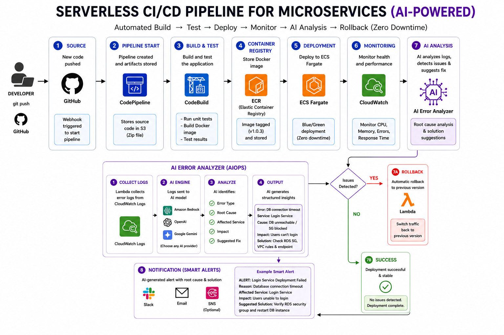
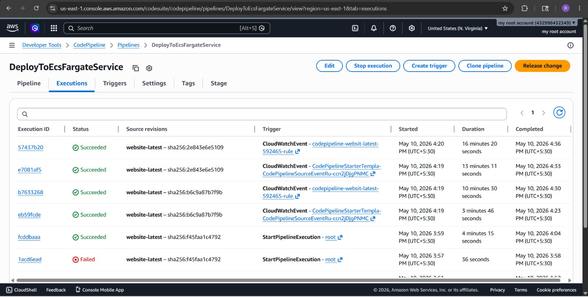
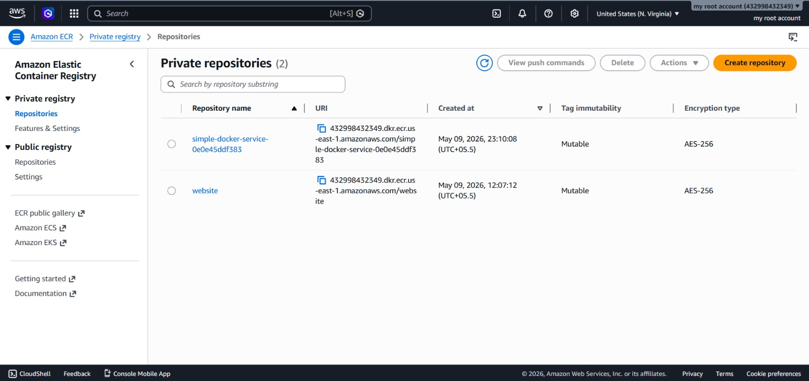
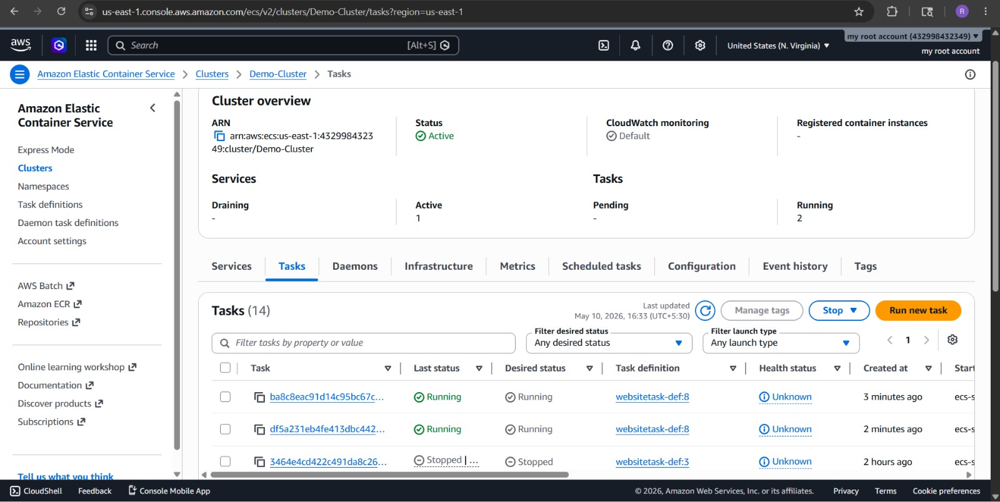
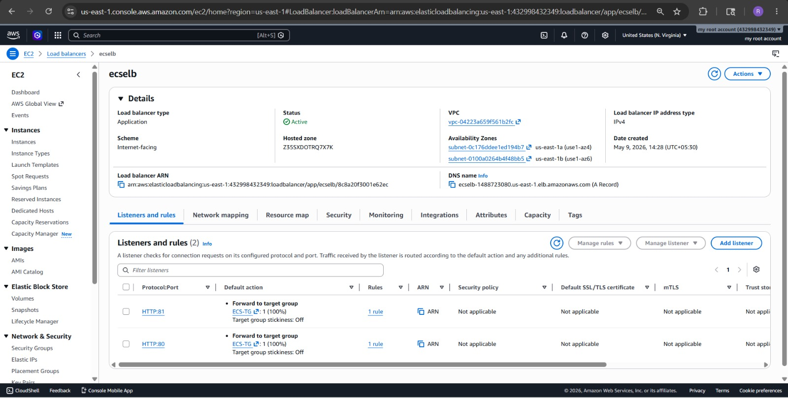
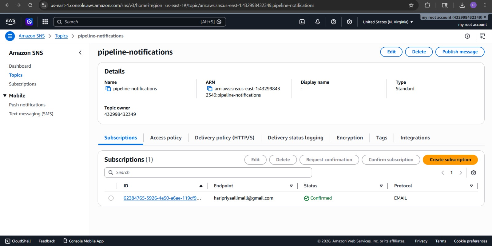
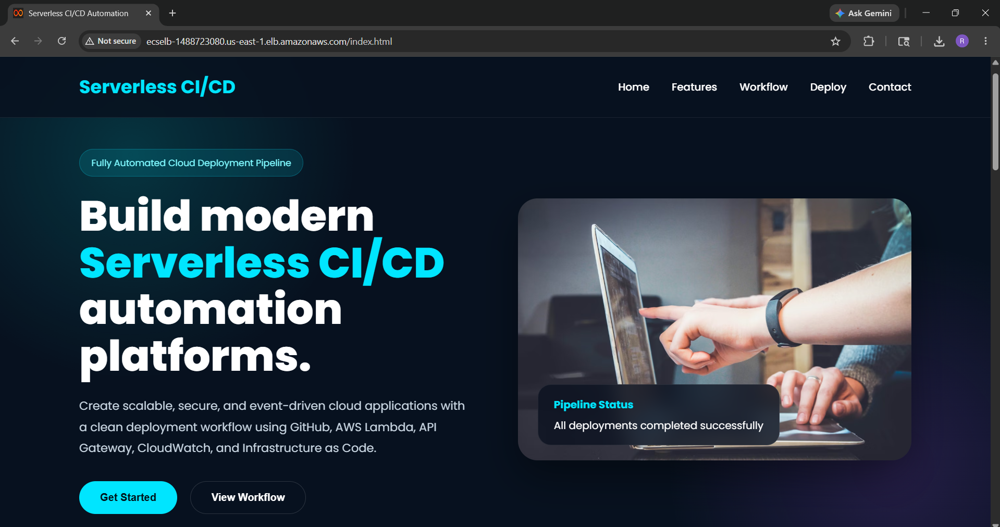
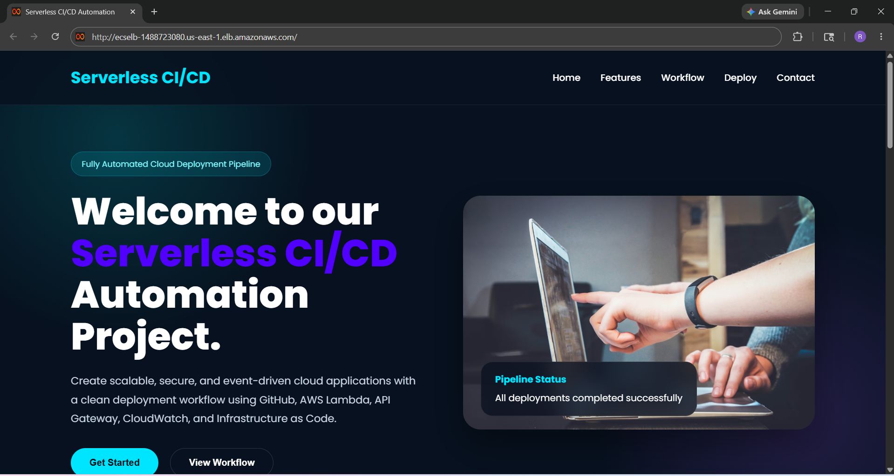
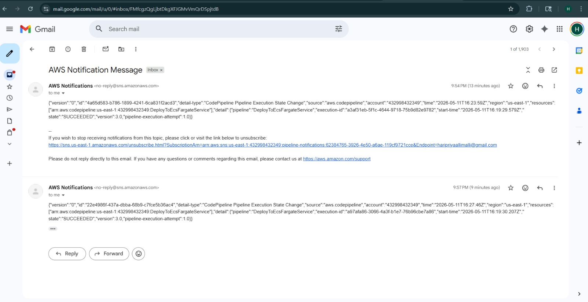

# 🚀 Serverless CI/CD Automation

## 📌 Project Overview

Traditional software deployment processes are often manual, time-consuming, error-prone, and may cause downtime during releases. Troubleshooting deployment failures also requires engineers to manually inspect logs across multiple systems, increasing operational complexity and recovery time.

This project provides a fully automated **Serverless CI/CD Pipeline** built using **AWS Cloud Services** that automatically:

✅ Builds applications  
✅ Runs tests  
✅ Creates Docker images  
✅ Pushes images to Amazon ECR  
✅ Deploys applications to Amazon ECS Fargate  
✅ Monitors applications using CloudWatch  
✅ Uses AI-powered log analysis for failure detection  
✅ Performs automatic rollback for failed deployments  
✅ Sends smart notifications with suggested fixes  


## 🎯 Problem Statement

Traditional deployment processes are manual, error-prone, and often cause downtime during application releases. Debugging deployment failures requires engineers to manually inspect logs across multiple services, increasing recovery time and operational complexity.

Organizations need an automated, scalable, and intelligent deployment pipeline that:

- Minimizes downtime
- Accelerates software releases
- Automatically detects failures
- Provides AI-based root cause analysis
- Supports scalable microservices deployment

## 💡 Proposed Solution

A fully automated serverless CI/CD pipeline built using AWS cloud services that automatically builds, tests, deploys, monitors, and rolls back containerized microservices.

The solution integrates AI-powered log analysis using Amazon Bedrock/OpenAI/Gemini to analyze deployment failures using CloudWatch logs and provide intelligent failure explanations and suggested fixes through SNS notifications.

## 📁 Project Structure

```bash
ServerlessAutomation/
│
├── Screenshots/
│   ├── Architecture.png
│   ├── CloudBuild.jpeg
│   ├── CloudWatch_Alarm.jpeg
│   ├── CloudWatch_Logs.jpeg
│   ├── CodePipeline.jpeg
│   ├── DockerImage.jpeg
│   ├── EC2.jpeg
│   ├── ECR_Images.jpeg
│   ├── ECR.jpeg
│   ├── ECS_Cluster.jpeg
│   ├── ECS_Fargate.jpeg
│   ├── ECS_Tasks.jpeg
│   ├── Initial_Application.png
│   ├── LoadBalancer.jpeg
│   ├── SNS_Message.jpeg
│   ├── SNS.jpeg
│   └── Updated_Application.png
│
├── buildspec.yml
├── cloud.jpg
├── contact.html
├── deploy.html
├── Deployment_Steps.md
├── Dockerfile
├── features.html
├── index.html
├── README.md
├── style.css
└── workflow.html
```

## 🏗️ Architecture Diagram




## ⚙️ Tech Stack

| Technology | Purpose |
|---|---|
| GitHub | Source Code Management |
| Docker | Containerization |
| AWS CodePipeline | CI/CD Pipeline Automation |
| AWS CodeBuild | Build & Test Automation |
| Amazon ECR | Docker Image Storage |
| Amazon ECS Fargate | Container Deployment |
| Amazon CloudWatch | Monitoring & Logging |
| Amazon SNS | Notifications & Alerts |
| AWS IAM | Access Management |
| Amazon Bedrock / OpenAI / Gemini | AI Log Analysis |
| Microservices Architecture | Scalable Application Design |


## 🔄 Workflow

### 1️. Source Stage
- Developer pushes code to GitHub repository.
- GitHub webhook automatically triggers AWS CodePipeline.

### 2️. Pipeline Start
- CodePipeline fetches source code.
- Source artifacts are stored temporarily.

### 3️. Build & Test Stage
- AWS CodeBuild:
  - Builds application
  - Runs tests
  - Builds Docker image
  - Generates artifacts

### 4️. Container Registry
- Docker image is pushed to Amazon ECR.

### 5️. Deployment Stage
- ECS Fargate deploys the latest container image.
- Blue/Green deployment strategy ensures zero downtime.

### 6️. Monitoring Stage
- CloudWatch monitors:
  - CPU usage
  - Memory
  - Logs
  - Errors
  - Response times

### 7️. AI Error Analysis
- CloudWatch logs are sent to AI engine.
- AI analyzes:
  - Error type
  - Root cause
  - Impact
  - Suggested solution

### 8️. Smart Notifications
- SNS sends alerts through:
  - Email
  - Slack
  - Other integrations

### 9️. Automatic Rollback
- If deployment fails:
  - Lambda triggers rollback
  - Traffic switches back to previous stable version

## CI/CD Flow
```bash
GitHub Push → CodePipeline → CodeBuild → ECR → ECS Fargate → Load Balancer → Live Website
```

## 🐳 Docker Configuration

This project uses Docker for containerizing the application.

### Files Used
- `Dockerfile`
- `buildspec.yml`

## Docker Build Command

```bash
docker build -t serverless-cicd .
```

## Docker Run Command

```bash
docker run -p 80:80 serverless-cicd
```

## AWS Services Used

### AWS CodePipeline
Automates the complete CI/CD workflow.

### AWS CodeBuild
Builds Docker images and executes tests.

### Amazon ECR
Stores Docker container images securely.

### Amazon ECS Fargate
Runs containers without managing servers.

### Amazon CloudWatch
Monitors application logs and performance.

### Amazon SNS
Sends deployment alerts and notifications.

### AWS IAM
Provides secure role-based access control.


## 🤖 AI-Powered Failure Analysis

The AI module analyzes CloudWatch logs and provides:

- Root cause analysis
- Error classification
- Suggested fixes
- Impact analysis
- Intelligent troubleshooting guidance

### Example:

```bash
Error: Database connection timeout

Cause:
Database unreachable / Security Group blocked

Impact:
Users unable to login

Suggested Fix:
Check RDS Security Group and VPC configuration
```

## 📸 Project Screenshots

### AWS CodePipeline Workflow
AWS CodePipeline automatically triggers build and deployment whenever code changes are pushed to GitHub.



### Amazon ECR Repository
Docker container images are automatically stored and versioned inside Amazon Elastic Container Registry (ECR).



### ECS Cluster Deployment
Amazon ECS Fargate deploys and manages the containerized application automatically.



### Load Balancer Configuration

Application Load Balancer distributes traffic to ECS services for high availability.



### Amazon SNS Notifications

Amazon SNS is configured to send automatic email notifications whenever the CI/CD pipeline execution succeeds or fails.



### Initial Deployed Application

Final deployed Serverless CI/CD Automation application running successfully.




## What Happens After Code Changes?

Whenever new code is pushed to GitHub:

1. CodePipeline gets triggered automatically
2. CodeBuild builds the Docker image
3. Docker image is pushed to ECR
4. ECS Fargate deploys the latest container
5. CloudWatch monitors the deployment
6. Updated changes automatically reflect in the application


### Updated Application After Git Push



### SNS Email Notification

SNS sends deployment status notifications directly to the subscribed email endpoint.
An **Successful Deployment** email is sent to the registered email.



## How to Verify the Project

### Step 1
Clone the repository.

```bash
git clone https://github.com/RemillaSriVaishnavi/Serverless-CICD-Automation.git
```

### Step 2
Push changes to GitHub.

### Step 3
Verify:
- CodePipeline execution starts automatically
- CodeBuild successfully builds Docker image
- Image is pushed to ECR
- ECS service updates automatically
- Website changes reflect automatically
- CloudWatch logs are generated
- AI analysis works during failures
- SNS notifications are received


## Key Features

- Fully automated CI/CD pipeline
- Serverless deployment approach
- Docker containerization
- Automated build & deployment
- Zero downtime deployment
- AI-powered error analysis
- Automatic rollback mechanism
- Cloud-based monitoring
- Smart notifications
- Scalable microservices architecture


## 🔐 Security Features

- IAM role-based access
- Secure container storage in ECR
- CloudWatch monitoring
- Controlled deployment permissions
- Secure notification system

## Future Enhancements

- Kubernetes (EKS) integration
- Multi-region deployment
- Advanced AI remediation
- Canary deployments
- Terraform Infrastructure as Code
- DevSecOps integration
- Automated security scanning


### Project:
Serverless CI/CD Automation using AWS Cloud Services


## Conclusion

This project demonstrates how AWS cloud services can be combined to build a scalable, intelligent, and automated CI/CD system for modern microservices applications.

The integration of AI-powered log analysis improves deployment reliability, reduces downtime, accelerates troubleshooting, and enhances operational efficiency.
